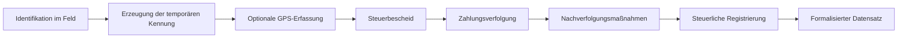

# 🏛️DOFK_Pro – SIGP

## Système Intégré de Gestion de la Préfiscalisation
### Plattformübergreifendes System zur Erfassung von Steuerpflichtigen zur Formalisierung des informellen Sektors in Togo

🌐 **Verfügbare Sprachen:** [English](README.md) · [Français](readme_fr.md) · [Deutsch](readme_de.md)

---

## 📌 Überblick

**🏛️DOFK_Pro SIGP (Système Intégré de Gestion de la Préfiscalisation)** ist ein plattformübergreifendes System, das Steuerbeamte im Außendienst dabei unterstützt, Wirtschaftsakteure des informellen Sektors zu identifizieren, zu begleiten und zu formalisieren.

Es bietet eine einheitliche Möglichkeit, den gesamten Lebenszyklus eines Steuerpflichtigen über native mobile, plattformübergreifende und webbasierte Clients hinweg zu verwalten:

**Identifikation → Vorregistrierung → Feldbegleitung → Zahlungsverfolgung → Steuerliche Registrierung (Steuernummer)**

Ziel ist es, die Datenqualität und Nachvollziehbarkeit im Feld zu verbessern, die Koordination zwischen den Außendienstmitarbeitern zu stärken und die schrittweise Eingliederung informeller Tätigkeiten in die formelle Steuerbasis zu unterstützen — bei gleichzeitiger Wahrung von Verhältnismäßigkeit, Sicherheit und Zugriffskontrolle der erhobenen personenbezogenen und finanziellen Daten.

---

## 🎯 Ausgangslage und Problemstellung

Ein erheblicher Teil der Wirtschaftstätigkeit in Togo findet außerhalb des formellen Steuerregisters statt. Akteure ohne Steueridentifikationsnummer (NIF) werden traditionell über Papierformulare und getrennte Tabellenkalkulationen erfasst, was zu Folgendem führt:

- Verlust oder Duplizierung von Steuerpflichtigen-Datensätzen
- Fehlende gemeinsame Übersicht über bereits erfolgte Besuche oder Steuerbescheide
- Eingeschränkte Sichtbarkeit ausstehender Zahlungen
- Kein verlässlicher Verlauf der Interaktionen mit einem bestimmten Steuerpflichtigen
- Erschwerte Koordination zwischen Außendienstmitarbeitern und Vorgesetzten

SIGP ersetzt dies durch einen gemeinsamen digitalen Datensatz pro Steuerpflichtigem, der offline im Feld nutzbar und zentral synchronisiert ist.

---

## 💡 Grundkonzept

Jeder im Feld identifizierte Steuerpflichtige — registriert oder nicht — wird über eine eindeutige Kennung verfolgt.

Steuerpflichtige ohne Steuernummer erhalten eine **temporäre lokale Kennung** (z. B. `K02-200001`), die bis zur Ausstellung einer offiziellen Steuernummer verwendet wird; bereits registrierte Steuerpflichtige werden unter dieser Nummer verfolgt und überprüft.

Diese Kennung gewährleistet:

- Einen einzigen Datensatz pro Steuerpflichtigem, ohne Duplikate
- Kontinuität des Verlaufs vom Erstkontakt bis zur formellen Registrierung
- Konsistente Nachverfolgung über Mitarbeiter und Besuche hinweg

---

## 📱 Plattformen und Anwendungen

SIGP besteht aus einer kleinen Familie von Client-Anwendungen, die dasselbe Datenmodell teilen, statt aus einer einzigen monolithischen Anwendung:

| Anwendung | Technologie | Rolle |
|---|---|---|
| **Android-App** | Kotlin, Jetpack Compose | Primäres Außendienst-Tool; offlinefähige Dateneingabe und Synchronisation |
| **iOS-App** | Swift, SwiftUI | Funktionsgleiche Begleit-App für Mitarbeiter mit iPhone |
| **Plattformübergreifende App** | TypeScript, React Native / Expo | Gemeinsamer Mobil-/Web-Client für leichtere Bereitstellungen |
| **Legacy-Konnektor** | Google Apps Script | Optionales, schlankes Backend für Pilotprojekte oder Umgebungen mit eingeschränkter Konnektivität |

Alle Clients lesen und schreiben dieselben Steuerpflichtigen-Datensätze über ein zentrales Backend: Ein auf einem Gerät angelegter Steuerpflichtiger ist sofort für jeden anderen berechtigten Mitarbeiter oder Vorgesetzten sichtbar.

---

## 🚀 Hauptfunktionen

### 👤 Verwaltung der Steuerpflichtigen
- Erfassung nicht registrierter Steuerpflichtiger unter temporärer Kennung
- Überprüfung bereits registrierter Steuerpflichtiger (Gültigkeit der Steuernummer, angegebene Tätigkeit, Unstimmigkeiten)
- Erfassung von Tätigkeit, Sektor, Kontaktdaten und Feldbeobachtungen

### 📍 Geolokalisierung im Feld
- Optionale GPS-Erfassung bei der Identifikation, zur Kartierung und Besuchsplanung
- Standortdaten werden nur erhoben, wenn sie für den jeweiligen Einsatz relevant sind, und als personenbezogene Daten behandelt (siehe *Datenschutz* unten)

### 💰 Steuerbescheide und Zahlungen
- Erfassung von Steuerbescheiden (Steuerart, Betrag, Datum, Frist)
- Zahlungsverfolgung mit laufendem Saldo und vollständigem Verlauf
- Zahlungspläne für gestaffelte Begleichungen

### 📅 Nachverfolgung und Außendiensteinsätze
- Protokollierung von Besuchen, Einladungen, Erinnerungen (einschließlich Massen-Erinnerungskampagnen) und Verwaltungsnotizen
- SMS-Erinnerungen: direkter Versand vom Gerät unter Android, über ein gesichertes Messaging-Gateway unter iOS (Apple erlaubt keinen direkten SIM-basierten Versand)
- Nachverfolgung von Außendiensteinsätzen für Mitarbeiter auf zugewiesenen Routen

### 🛠️ Verwaltung
- Verwaltung von Mitarbeitern/Benutzern mit Rollen und Profilen
- Import/Export von Daten (CSV) für Massenvorgänge und Berichte
- Aktivitätsstatistiken pro Mitarbeiter

---

## 🔄 Lebenszyklus des Steuerpflichtigen



---

## 🏗️ Systemarchitektur

```
      Android-App         iOS-App          Web-/Plattformübergreifende App
     (Kotlin/Compose)   (Swift/SwiftUI)         (React Native / Expo)
              \                 |                    /
               \                |                   /
                \-------------- Backend-API --------/
                                 |
                    Verwaltete PostgreSQL-Datenbank
                                 |
                  Authentifizierung & Zugriffskontrolle
                                 |
              (Optional) Legacy-Tabellen-Konnektor
                      für Pilotbereitstellungen
```

SMS-Erinnerungen werden über ein dediziertes Gateway geleitet, anstatt Anbieter-Zugangsdaten direkt in die Client-Apps einzubetten — so verbleiben auf den Geräten der Mitarbeiter keine dauerhaften Geheimnisse.

---

## 🗄️ Datenmodell (vereinfacht)

```
Steuerpflichtiger
│
├── lokale_id           # temporäre Kennung vor Ausstellung der Steuernummer
├── steuernummer         # offizielle Steuernummer, sobald verfügbar
├── name, telefon
├── taetigkeit, sektor
├── gps_koordinaten      # optional, im Feld erfasst
├── status
│
├── Steuerbescheid
│      ├── betrag, steuerart
│      ├── datum
│      └── status
│
├── Zahlung
│      ├── betrag, datum
│      └── referenz
│
├── Nachverfolgung / Termin
│      ├── datum, typ
│      └── status
│
└── Außendiensteinsatz
       ├── mitarbeiter
       ├── route
       └── besuchsprotokoll

Benutzer (Mitarbeiter)
│
├── login, rolle/profil
└── zugewiesener Bereich
```

> Die oben genannten Feld-/Tabellennamen sind illustrativ. Tatsächliche Schemadefinitionen, Umgebungskennungen und Geheimnisse (Datenbank-URLs, API-Schlüssel, Tabellenreferenzen) sind nicht Teil dieses Dokuments und nicht Teil der Versionskontrolle — siehe *Datenschutz* unten.

---

## 📊 Indikatoren und Auswertungen

**Indikatoren zu Steuerpflichtigen:** Anzahl identifiziert, Anzahl formell registriert, geografische und sektorale Verteilung.

**Finanzindikatoren:** Gesamtbetrag der Bescheide, Gesamteinnahmen, Erhebungsquote, ausstehende Salden.

**Operative Indikatoren:** Außendienstbesuche, Nachverfolgungsmaßnahmen, Konversionsrate von Vorregistrierung zu Steuernummer, Aktivität pro Mitarbeiter.

---

## 🔒 Datenschutz

SIGP verarbeitet personenbezogene Daten (Namen, Telefonnummern, GPS-Standorte) sowie Finanzdaten von Steuerpflichtigen. Das Projekt folgt daher — unabhängig von der jeweiligen Rechtsordnung — Prinzipien des *Privacy by Design*, angelehnt an bewährte DSGVO-Praxis:

- **Datenminimierung** — es werden nur die für den Zweck der Vorregistrierung erforderlichen Felder erhoben (GPS ist z. B. optional und einsatzbezogen, keine kontinuierliche Nachverfolgung).
- **Zweckbindung** — Daten der Steuerpflichtigen werden ausschließlich für Identifikation, Bescheiderstellung und Nachverfolgung verwendet, nicht stillschweigend zweckentfremdet.
- **Zugriffskontrolle** — der Zugriff ist rollenbasiert (Mitarbeiter / Vorgesetzter / Administrator); kein anonymer Zugriff auf Datensätze von Steuerpflichtigen.
- **Verwaltung von Geheimnissen** — Datenbank-URLs, API-Schlüssel und Zugangsdaten des Messaging-Gateways werden über lokale/umgebungsspezifische Konfigurationsdateien verwaltet, die von der Versionskontrolle ausgeschlossen sind, niemals fest im Code hinterlegt oder committet.
- **Keine echten Daten in der Dokumentation** — dieses README und zugehörige Dokumente verwenden ausschließlich fiktive Kennungen, Beträge und Koordinaten.
- **Aufbewahrung** — historische Datensätze werden nur so lange aufbewahrt, wie es für den Formalisierungs- und Prüfzweck erforderlich ist; Aufbewahrungsregeln sind auf Ebene der jeweiligen Bereitstellung gemäß den anwendbaren lokalen Vorschriften festzulegen.

Wer SIGP betreibt, ist selbst für die Konfiguration eigener Zugangsdaten und Zugriffsrichtlinien sowie für die Einhaltung der in der jeweiligen Rechtsordnung geltenden Datenschutzvorschriften verantwortlich.

---

## 🛠️ Technologie-Stack

**Mobil — Android:** Kotlin, Jetpack Compose

**Mobil — iOS:** Swift, SwiftUI, XcodeGen

**Plattformübergreifend mobil/web:** TypeScript, React Native, Expo Router

**Backend & Datenbank:** Verwaltetes PostgreSQL-Backend mit REST-Zugriff und zeilenbasierten Zugriffsrichtlinien

**Messaging:** Gesichertes SMS-Gateway (Serverless-Funktion) für Plattformen ohne direkten SIM-Zugriff

**Legacy-/Pilot-Konnektor:** Schlankes skriptbasiertes Backend für frühe oder konnektivitätsarme Pilotprojekte

**Build-Tools:** Gradle (Android), XcodeGen (iOS), pnpm/Expo CLI (plattformübergreifende App)

---

## 🔮 Geplante Weiterentwicklungen

- Automatisierte, konfigurierbare Erinnerungspläne
- GIS-Dashboards zur Planung von Außendienstbesuchen
- Risikobasierte Priorisierung von Nachverfolgungen
- Interoperabilität mit nationalen Steuerinformationssystemen
- Konsolidiertes, plattformübergreifendes Analyse-Dashboard

---

## 🌍 Wirkung

✅ Bessere Identifikation und Nachverfolgbarkeit von Steuerpflichtigen
✅ Sauberere, deduplizierte Daten zu Steuerpflichtigen
✅ Stärkere, besser koordinierte Außendiensttätigkeit
✅ Schrittweise Formalisierung des informellen Sektors
✅ Modernisierte und datenschutzbewusste Instrumente der Steuerverwaltung

---

## 👨‍💻 Autor

Digitales Transformationsprojekt zur Verbesserung der Nachverfolgung von Steuerpflichtigen durch mobile Außendienst-Tools, strukturierte Daten und einen verantwortungsvollen Umgang mit personenbezogenen Informationen.
