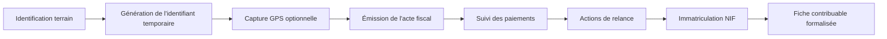

# 🏛️ DOFK_Pro – SIGP

## Système Intégré de Gestion de la Préfiscalisation
### Système multi-plateforme de suivi des contribuables pour la formalisation du secteur informel au Togo

🌐 **Langues disponibles :** [English](README.md) · [Français](readme_fr.md) · [Deutsch](readme_de.md)

---

## 📌 Présentation

**DOFK_Pro SIGP (Système Intégré de Gestion de la Préfiscalisation)** est un système multi-plateforme conçu pour accompagner les agents des impôts sur le terrain dans l'identification, le suivi et la formalisation des opérateurs économiques du secteur informel.

Il offre une manière unique et cohérente de gérer le cycle de vie du contribuable, via des clients mobiles natifs, multiplateformes et web :

**Identification → Préfiscalisation → Suivi terrain → Suivi des paiements → Immatriculation fiscale (NIF)**

L'objectif est d'améliorer la qualité et la traçabilité des données collectées sur le terrain, de renforcer la coordination entre agents, et de soutenir l'intégration progressive de l'activité informelle dans l'assiette fiscale formelle — tout en veillant à ce que les données personnelles et financières collectées restent proportionnées, sécurisées et soumises à un contrôle d'accès strict.

---

## 🎯 Contexte et problématique

Une part importante de l'activité économique au Togo se déroule en dehors du registre fiscal formel. Les opérateurs sans Numéro d'Identification Fiscale (NIF) sont traditionnellement suivis via des formulaires papier et des tableurs disjoints, ce qui entraîne :

- La perte ou la duplication de dossiers de contribuables
- L'absence de vision partagée des visites déjà effectuées ou des actes déjà émis
- Une visibilité limitée sur les paiements en souffrance
- L'absence d'historique fiable des échanges avec un contribuable donné
- Une coordination difficile entre agents de terrain et superviseurs

Le SIGP remplace ces pratiques par une fiche numérique partagée par contribuable, utilisable hors connexion sur le terrain et synchronisée de manière centralisée.

---

## 💡 Concept fondamental

Chaque contribuable identifié sur le terrain — immatriculé ou non — est suivi grâce à un identifiant unique.

Les contribuables sans NIF reçoivent un **identifiant local temporaire** (ex. `K02-200001`) utilisé jusqu'à l'attribution d'un NIF officiel ; les contribuables déjà immatriculés sont suivis et vérifiés sous ce numéro.

Cet identifiant garantit :

- Une fiche unique par contribuable, sans doublon
- La continuité de l'historique, du premier contact jusqu'à l'immatriculation formelle
- Une traçabilité cohérente entre agents et visites

---

## 📱 Plateformes et applications

Le SIGP se compose d'une petite famille d'applications clientes partageant le même modèle de données, plutôt que d'une application monolithique unique :

| Application | Technologies | Rôle |
|---|---|---|
| **Application Android** | Kotlin, Jetpack Compose | Outil terrain principal des agents ; saisie et synchronisation hors ligne |
| **Application iOS** | Swift, SwiftUI | Application compagnon aux fonctionnalités équivalentes pour les agents sur iPhone |
| **Application multiplateforme** | TypeScript, React Native / Expo | Client mobile/web partagé pour des déploiements plus légers |
| **Connecteur historique** | Google Apps Script | Backend allégé optionnel pour les contextes pilotes ou à connectivité limitée |

Tous les clients lisent et écrivent dans les mêmes fiches contribuables via un backend central : un contribuable créé sur un appareil est immédiatement visible par tout autre agent ou superviseur autorisé.

---

## 🚀 Fonctionnalités principales

### 👤 Gestion des contribuables
- Enregistrement des contribuables non immatriculés sous identifiant temporaire
- Vérification des contribuables déjà immatriculés (validité du NIF, activité déclarée, incohérences)
- Saisie de l'activité, du secteur, des coordonnées de contact et des observations de terrain

### 📍 Géolocalisation terrain
- Capture GPS optionnelle au moment de l'identification, pour la cartographie et la planification des visites
- Les données de localisation ne sont collectées que lorsqu'elles sont pertinentes pour la mission terrain, et traitées comme des données personnelles (voir *Protection des données* ci-dessous)

### 💰 Actes fiscaux et paiements
- Enregistrement des actes fiscaux (type, montant, date, échéance)
- Suivi des paiements avec solde courant et historique complet
- Échéanciers pour les règlements échelonnés

### 📅 Suivi et missions terrain
- Journalisation des visites, invitations, relances (y compris campagnes de relance groupées) et notes administratives
- Relances par SMS : envoi direct depuis l'appareil sous Android, et via une passerelle de messagerie sécurisée sous iOS (Apple ne permettant pas l'envoi direct par carte SIM)
- Suivi des missions terrain pour les agents affectés à des circuits

### 🛠️ Administration
- Gestion des agents/utilisateurs avec rôles et profils
- Import/export de données (CSV) pour les opérations en masse et le reporting
- Statistiques d'activité par agent

---

## 🔄 Cycle de vie du contribuable



---

## 🏗️ Architecture du système

```
      App Android         App iOS         App Web / Multiplateforme
     (Kotlin/Compose)   (Swift/SwiftUI)      (React Native / Expo)
              \                 |                    /
               \                |                   /
                \-------------- API Backend --------/
                                 |
                     Base de données PostgreSQL managée
                                 |
                    Authentification & contrôle d'accès
                                 |
                  (Optionnel) Connecteur tableur historique
                        pour déploiements pilotes
```

Les relances SMS transitent par une passerelle dédiée plutôt que d'intégrer des identifiants d'opérateur directement dans les applications clientes, afin qu'aucun secret durable ne soit stocké sur les appareils des agents.

---

## 🗄️ Modèle de données (simplifié)

```
Contribuable
│
├── identifiant_local     # identifiant temporaire avant attribution du NIF
├── nif                   # numéro fiscal officiel, une fois disponible
├── nom, telephone
├── activite, secteur
├── coordonnees_gps       # optionnelles, saisies sur le terrain
├── statut
│
├── Acte fiscal
│      ├── montant, type_impot
│      ├── date
│      └── statut
│
├── Transaction (paiement)
│      ├── montant, date
│      └── reference
│
├── Relance / Rendez-vous
│      ├── date, type
│      └── statut
│
└── Mission terrain
       ├── agent
       ├── circuit
       └── journal des visites

Utilisateur (Agent)
│
├── identifiant, rôle/profil
└── section affectée
```

> Les noms de champs/tables ci-dessus sont donnés à titre illustratif. Les schémas réels, les identifiants d'environnement et les secrets (URL de base de données, clés d'API, références de tableur) ne figurent pas dans ce document ni dans le contrôle de version — voir *Protection des données* ci-dessous.

---

## 📊 Indicateurs et analyses

**Indicateurs contribuables :** nombre identifié, nombre formellement immatriculé, répartition géographique et sectorielle.

**Indicateurs financiers :** total émis, total recouvré, taux de recouvrement, soldes restants.

**Indicateurs opérationnels :** visites terrain, actions de relance, taux de conversion de la préfiscalisation vers le NIF, activité par agent.

---

## 🔒 Protection des données

Le SIGP traite des données personnelles (noms, numéros de téléphone, positions GPS) et des données financières appartenant aux contribuables. Le projet applique donc des principes de protection des données dès la conception (*privacy by design*), inspirés des bonnes pratiques du RGPD, indépendamment de la juridiction d'application :

- **Minimisation des données** — seuls les champs nécessaires à l'objectif de préfiscalisation sont collectés (le GPS, par exemple, est optionnel et lié à une mission ponctuelle, non à un suivi continu).
- **Limitation de la finalité** — les données des contribuables ne sont utilisées que pour l'identification, l'émission d'actes et le suivi, sans détournement silencieux d'usage.
- **Contrôle d'accès** — l'accès est basé sur les rôles (agent / superviseur / administrateur) ; aucun accès anonyme aux fiches contribuables.
- **Gestion des secrets** — les URL de base de données, clés d'API et identifiants de passerelle de messagerie sont configurés via des fichiers de configuration locaux/environnementaux exclus du contrôle de version, jamais codés en dur ni committés.
- **Aucune donnée réelle dans la documentation** — ce README et les documents associés utilisent uniquement des identifiants, montants et coordonnées fictifs.
- **Conservation des données** — les données historiques ne sont conservées que le temps nécessaire à la finalité de formalisation et d'audit ; les règles de conservation doivent être définies au niveau du déploiement, conformément à la réglementation locale applicable.

Toute personne déployant le SIGP est responsable de la configuration de ses propres identifiants et politiques d'accès, ainsi que de la conformité du déploiement avec les règles de protection des données applicables dans sa juridiction.

---

## 🛠️ Stack technique

**Mobile — Android :** Kotlin, Jetpack Compose

**Mobile — iOS :** Swift, SwiftUI, XcodeGen

**Multiplateforme mobile / web :** TypeScript, React Native, Expo Router

**Backend & base de données :** Backend PostgreSQL managé avec accès REST et politiques d'accès au niveau des lignes

**Messagerie :** Passerelle SMS sécurisée (fonction serverless) pour les plateformes sans accès direct à la carte SIM

**Connecteur historique / pilote :** Backend scripté léger pour les premiers déploiements pilotes ou à connectivité limitée

**Outillage de build :** Gradle (Android), XcodeGen (iOS), pnpm/Expo CLI (application multiplateforme)

---

## 🔮 Améliorations futures

- Relances automatisées et paramétrables
- Tableaux de bord SIG pour la planification des visites terrain
- Priorisation des relances basée sur le risque
- Interopérabilité avec les systèmes d'information fiscaux nationaux
- Tableau de bord analytique consolidé multiplateforme

---

## 🌍 Impact

✅ Meilleure identification et traçabilité des contribuables
✅ Données contribuables plus propres et dédupliquées
✅ Opérations de terrain renforcées et mieux coordonnées
✅ Formalisation progressive du secteur informel
✅ Outils de gestion fiscale modernisés et respectueux de la vie privée

---

## 👨‍💻 Auteur

Projet de transformation numérique visant à améliorer le suivi des contribuables grâce à des outils terrain mobile-first, des données structurées et un traitement responsable des informations personnelles.
